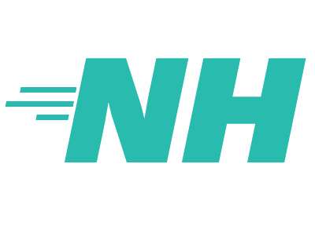

# Go client for the Nokia Health API

This is a go client that allows easy access to the Nokia Health API and as of v2 supports the required Oauth2. More documentation regarding the Nokia Health API can be found [here](http://developer.health.nokia.com/oauth2/#tag/introduction). More detailed documentation of the client can be found in the [godocs](https://godoc.org/github.com/jrmycanady/nokiahealth).

## v1 to v2 Changes

Nokia changed the API to allow Oauth2 while removing Oauth1 as an option. Due to this change, the client API has changed when it comes to handling authentication and tokens. For the most part the changes make things easier but they are breaking changes. The good new is there is no longer a dependency on the forked Ouath1 implementation. 

## Supported Resources
* User Access Requests
* Retrieving user body measurements
* Retrieve activity measurements
* Retrieve workouts
* Retrieve intraday activities - Apparently requires additional authorization which I don't have yet so no testing.
* Retrieve sleep measures - Limited testing so report any issues.
* Retrieve sleep summary - Limited testing so report any issues.
* Creating a notification
* Retrieving a single notification
* Retrieving all notifications for a user
* Revoke notifications

## Installation
  go get github.com/jrmycanady/nokiahealth

## Highlevel Usage Overview
It's best if you read up on Oauth2 if you are not familiar but the client should be simple enough to get working without understanding how Oauth2 works.

### New User
* Create a [nokia account and register your app](https://account.health.nokia.com/partner/dashboard_oauth2).
* Create a client and perform the tasks to get the token/user struct.
    * Send user to Oauth2 authorization URL.
    * Catch the redirect back via a server or manually pulling the "code" from the path.
    * Generate a user.
* Execute queries!

### Returning User
* Create client (Assuming you have an account otherwise the user couldn't be returning...)
* Generate user from stored token.
* Execute queries!

## Highlevel Usage Example

### New User

**1. Obtain your ClientID and ClientSecret**
**2. Create a new client**
```go
clientID := "id"
clientSecrete := "secret"
clientRedirectURL := "url" // This is the URL nokia will redirect the client to 
                           // after they authorized your application. This is
                           // the same URL you provided when you registered your
                           // application with Nokia. 
                           // For any real world use you will need to have a
                           // http server running and listening on that URL
                           // so you can obtain the code that is retruned.
                           // For simple testing you can just manually navigate
                           // to the URL that will be generated and copy the
                           // code.

client := nokiahealth.NewClient(clientID, clientSecret, clientRedirectURL)
```
**3. Generate the authorization URL.**
```go
authURL, _, err := client.AuthCodeURL() // Ignoring the state in this example
                                        // but in realworld use you will want
                                        // to record this to compare to the
                                        // state value returned by the redirect
                                        // from nokia to verify its a redirect
                                        // from your request. 
                                        // The stat is auto generated for you
                                        // using cyrto/rand but the random
                                        // generation can be replaced with your
                                        // own function if you would like.
```
**4. User navigates to URL and the code and state are retrieved.**
**5. Create new user using returned code.**
```go
u, err := client.NewUserFromAuthCode(context.Background(), code) // Obviously
                                        // use whatever context you would like
                                        // here.
if err != nil {
    panic(err) // Handle the error however is appropriate for your code.
}
```
**6. DONE - you now have a user that can make data requests.**

### Returning User

**1. Create a new client**
```go
clientID := "id"
clientSecrete := "secret"
clientRedirectURL := "url" // This is the URL nokia will redirect the client to 
                           // after they authorized your application. This is
                           // the same URL you provided when you registered your
                           // application with Nokia. 
                           // For any real world use you will need to have a
                           // http server running and listening on that URL
                           // so you can obtain the code that is returned.
                           // For simple testing you can just manually navigate
                           // to the URL that will be generated and copy the
                           // code.

client := nokiahealth.NewClient(clientID, clientSecret, clientRedirectURL)
```
**2. Generate a new user from the stored tokens.**
```go
// This creates a new user based on the tokens provided. Technically the 
// accessToken can be gibberish and the refresh Token is the one that is really
// required.
u, err := client.NewUserFromRefreshToken(context.Background(), accessToken, refreshToken)
```
**3. DONE - you now have a user that can make data requests.**


## Making Requests
Requests are performed from methods on the User. Each request accepts a specific query struct with the details for the request. For example:
```go
p := nokiahealth.BodyMeasuresQueryParams{}

t := time.Now().AddDate(0, 0, -14)
p.StartDate = &t

m, err := u.GetBodyMeasures(&p)
```

In most cases the response will contain all the information you need. Some methods provide additional optional processing that can provide a more usable form to the data. GetBodyMeasures is one of these methods. It's recommended to read the [docs](https://godoc.org/github.com/jrmycanady/nokiahealth) for each method to see how best to use them.

```go
measures := m.ParseData()
```

## Making context Requests
Every request method has a partner method ending with Ctx that takes a context
that will be used for the HTTP call. This allows you to provide a custom context
if you desire.
```go
p := nokiahealth.BodyMeasuresQueryParams{}

t := time.Now().AddDate(0, 0, -14)
p.StartDate = &t

m, err := u.GetBodyMeasuresCtx(context.Background(), &p)
```
